# Chatty Channels


[](https://github.com/nickfox/chatty-channels/actions/workflows/ci.yml)

## AI‑Powered Recording‑Studio Magic — Right Inside Logic Pro ✨

*What if every track in your session could talk back?*

Chatty Channels transforms your DAW into a collaborative studio environment by placing a lightweight **AIplayer** plugin on each channel, turning instruments into responsive band members. The master bus hosts an **AIengineer** with decades of mixing expertise, while the **Control Room** SwiftUI app powers the entire system with OpenAI's o3, orchestrating your session through AppleScript and MIDI.

*Simply tell the kick drum to "lower the volume by 3 dB," ask the bass to solo itself, or request the engineer to "add more reverb to the lead vocal"—all using natural language while your session continues playback.*

---

## Project Vision

Chatty Channels revolutionizes music production by enabling multi-agent AI collaboration within professional DAW environments. Rather than replacing human creativity, it enhances your workflow by creating a virtual collaborative studio:

- **AI Musicians on Channels**: Specialized entities that understand their instruments and respond to nuanced direction
- **AI Engineer on Master Bus**: Provides real-time mixing suggestions and technical guidance 
- **Producer in the Control Room**: Central application where you direct the session with natural language

Unlike standalone AI music generators, Chatty Channels integrates seamlessly into your existing Logic Pro workflow, preserving creative control while adding collaborative intelligence.

---

## Open‑Source Commitment

Chatty Channels is developed in the open, building on the creator's two decades of open source experience and 10 years as a sound engineer. Previous projects include [GPSTracker](https://github.com/nickfox/GpsTracker), which has garnered over 2.2 million downloads since 2007.

- **Production-Grade Code**: Comprehensive DocC/Doxygen documentation, automated CI testing, and robust error handling
- **Modular Architecture**: Built with SwiftUI, JUCE, and OSC to enable contributors to easily add new AI personas, effects, or DAW integrations
- **Community-Focused**: Designed for long-term support and active community engagement

---

## High‑level Architecture

```mermaid
sequenceDiagram
    participant LP as Logic Pro
    participant AP as AIplayer (AU)
    participant CR as Control Room.app
    participant LLM as Remote LLM (o3)

    Note over AP: per‑track RMS / FFT
    AP-->>CR: OSC /telemetry {rms:-18dB}
    CR-->>LP: AppleScript set fader "Kick" -3.0
    LP--)CR: ok
    CR-)AP: OSC /query rms?
    AP-->>CR: OSC /telemetry {rms:-21dB}
    CR-->>LLM: producer‑prompt JSON
    LLM-->CR: reply
```



- **AIplayer**: Lightweight sensor on every channel that streams RMS/FFT data and responds to queries
- **Control Room**: Orchestration UI and producer-AI that manipulates parameters via AppleScript/MIDI
- **Remote LLM**: Currently using OpenAI o4-mini with model-agnostic architecture
- **PID Feedback**: Closed-loop system that verifies changes through plugin confirmation

---

## Milestones & Development Status

| Target                | Core risk retired                                       | Key deliverable                             | Status |
| --------------------- | ------------------------------------------------------- | ------------------------------------------- | ------ |
| **v0.5**              | H1 AppleScript round‑trip, H3 OSC latency, H4 PID maths | Kick‑track closed‑loop demo                 | ✅ Completed Apr 27, 2025 |
| **v0.6 (🚧 current)** | H2 track‑UUID mapping, H5 telemetry scaling             | Auto‑follow VU meters, 64‑track stress test | In progress |
| **v0.7**              | H3 UDP retry logic                                      | Loss‑tolerant OSC transport                 | Planned |
| **v0.8**              | H5 lazy FFT, band‑energy payload                        | Telemetry v1.1                              | Planned |
| **v0.9**              | H6 LLM JSON schema                                      | Strict validator + prompt templates         | Planned |
| **v1.0 (ALPHA)**      | Full NVFE pass                                          | Public alpha release                        | Planned |

*(Full backlog & risk matrix available in [**`docs/plan.md`**](docs/plan.md).)*

---

## Getting Started

### Prerequisites

- macOS 14+
- Logic Pro 10.7+
- Xcode 16.2+
- JUCE 7 (for AU plugin development)
- Python 3.11 (for build scripts)

### Quick Setup

```bash
git clone https://github.com/nickfox/chatty-channels.git
cd chatty-channels
Scripts/bootstrap.sh         # pulls JUCE, installs git‑hooks
```

### Building the Control Room App

```bash
xcodebuild -project ChattyChannels.xcodeproj -scheme ControlRoom
# Or open in Xcode and build the ControlRoom scheme
```

### Installing the AIplayer Plugin

1. **Build the plugin**:
   ```bash
   cd AIplayer/AIplayer/Builds/MacOSX
   xcodebuild -project AIplayer.xcodeproj -target "AIplayer - AU" -configuration Debug
   ```

2. **Install the plugin**:
   ```bash
   mkdir -p ~/Library/Audio/Plug-Ins/Components
   cp -r build/Debug/AIplayer.component ~/Library/Audio/Plug-Ins/Components/
   ```

3. **Validate the installation**:
   ```bash
   auval -v aufx Dm4q Manu
   ```

4. **Debug with Logic Pro**:
   - Open the AIplayer Xcode project
   - Select the "AIplayer - AU" scheme
   - In scheme settings, set the executable to Logic Pro.app
   - Run the scheme to launch Logic Pro with the plugin in debug mode

### Features Implemented in v0.5

- Natural language control of Logic Pro parameters
- Real-time adjustments with PID control for precision
- Low-latency OSC communication (182ms round-trip time)
- AppleScript integration with playback safety mechanisms
- Direct AI command processing pipeline
- Comprehensive documentation and test coverage

---

## 📚 Documentation

- Architecture & Risk Backlog — [`docs/plan.md`](docs/plan.md)
- Iteration Diary — [`docs/iterations.md`](docs/iterations.md)

---

## Contributing

Found a bug? [Open an issue](https://github.com/nickfox/chatty-channels/issues/new).

Pull requests are welcome!  
Please open a Discussion before starting significant work to ensure alignment with the risk-driven roadmap.

---

## License

Apache 2.0 — see `LICENSE`.

---

*Chatty Channels is an independent project; Logic Pro® and related marks are property of Apple Inc.*
