```mermaid
sequenceDiagram
    participant LP as Logic Pro
    participant AP as AIplayer (AU)
    participant CR as Control Room.app
    participant LLM as Remote LLM (o3)

    Note over AP: per‑track RMS / FFT
    AP-->>CR: OSC /telemetry {rms:-18dB}
    CR-->>LP: AppleScript set fader "Kick" -3.0
    LP--)CR: ok
    CR-)AP: OSC /query rms?
    AP-->>CR: OSC /telemetry {rms:-21dB}
    CR-->>LLM: producer‑prompt JSON
    LLM-->CR: reply
```

# Chatty Channels


[](https://github.com/nickfox/chatty-channels/actions/workflows/ci.yml)

## AI‑Powered Recording‑Studio Magic — Right Inside Logic Pro ✨

*What if every track in your session could talk back?*

Chatty Channels drops a tiny **AIplayer** plugin onto *every* channel so each instrument becomes a chatty band‑mate. A master‑bus **AIengineer** lends seasoned ears. Up in the **Control Room** a SwiftUI app hosts a producer‑AI (fueled by OpenAI o3) that understands your creative direction and drives Logic Pro via AppleScript + MIDI.

*Tell the kick drum to "lower the volume by 3 dB," solo the bass for a sanity‑check, or ask the engineer to "put a little more reverb on the lead vocal"—all in plain English while the music keeps rolling.*

---

## Project Vision

Chatty Channels transforms music production by enabling multi-agent AI collaboration directly within professional DAW environments. Instead of replacing human creativity, it enhances it by providing a virtual collaborative studio experience:

- AI Musicians on Channels: Specialized AI entities that understand their instruments and respond to direction
- AI Engineer on Master Bus: Provides mixing suggestions and technical guidance
- Producer Control Room: Central Swift application where you orchestrate the session

Unlike standalone AI music generators, Chatty Channels integrates directly into your existing Logic Pro workflow, preserving your creative control while adding collaborative intelligence.

---

## Open‑Source Commitment

Chatty Channels is developed **in the open** and draws on over two decades of the developer's open source track record (as well as 10 years as a sound engineer) — including the project [GPSTracker](https://github.com/nickfox/GpsTracker) (over 2.2 million downloads since 2007).

- **Demonstrated reach** – GPS Tracker's adoption shows long‑term support and community engagement.
- **Quality first** – production‑grade code, DocC / Doxygen comments, CI tests, layered error‑handling.
- **Community focus** – Chatty Channels is modular (SwiftUI, JUCE, OSC) so contributors can add new AI personas, effects, or DAW integrations.

---

## High‑level architecture



- **AIplayer** — lightweight sensor on every channel; streams RMS/FFT and answers queries.
- **Control Room** — orchestration UI + producer‑AI; moves faders via AppleScript/MIDI.
- **Remote LLM** — currently OpenAI o4-mini; architecture is model‑agnostic.
- **PID feedback** — Control Room never trusts a change until the plugin confirms it.

---

## Milestones & risk status

| Target                | Core risk retired                                       | Key deliverable                             | Status |
| --------------------- | ------------------------------------------------------- | ------------------------------------------- | ------ |
| **v0.5**              | H1 AppleScript round‑trip, H3 OSC latency, H4 PID maths | Kick‑track closed‑loop demo                 | ✅ Completed Apr 27, 2025 |
| **v0.6 (🚧 current)** | H2 track‑UUID mapping, H5 telemetry scaling             | Auto‑follow VU meters, 64‑track stress test | In progress |
| **v0.7**              | H3 UDP retry logic                                      | Loss‑tolerant OSC transport                 | Planned |
| **v0.8**              | H5 lazy FFT, band‑energy payload                        | Telemetry v1.1                              | Planned |
| **v0.9**              | H6 LLM JSON schema                                      | Strict validator + prompt templates         | Planned |
| **v1.0 (ALPHA)**      | Full NVFE pass                                          | Public alpha release                        | Planned |

*(Detailed backlog & risk matrix in [**`docs/plan.md`**](docs/plan.md).)*

---

## Getting started

### Prerequisites

- macOS 14+
- Logic Pro 10.7+
- Xcode 16.2+
- JUCE 7 (for AU projects)
- Python 3.11 (build scripts)

### Quick clone & build

```bash
git clone https://github.com/nickfox/chatty-channels.git
cd chatty-channels
Scripts/bootstrap.sh         # pulls JUCE, installs git‑hooks
xcodebuild -project ChattyChannels.xcodeproj -scheme ControlRoom
```

### Features implemented in v0.5

- Natural language control of Logic Pro gain parameters
- Real-time parameter adjustments with PID control
- Low-latency OSC communication (182ms RTT)
- AppleScript integration with playback safety
- Direct AI command processing pipeline 
- Comprehensive DocC documentation
- Full test coverage with mock objects

---

## 📚 Docs

- Architecture & risk backlog — [`docs/plan.md`](docs/plan.md)
- Iteration diary — [`docs/iterations.md`](docs/iterations.md)

---

## Contributing

Found a glitch? [Open an issue](https://github.com/nickfox/chatty-channels/issues/new).

Pull requests welcome!  
Open a Discussion before major work so we stay aligned with the risk‑driven roadmap.

---

## License

Apache 2.0 — see `LICENSE`.

---

*Chatty Channels is an independent project; Logic Pro® and related marks are property of Apple Inc.*
